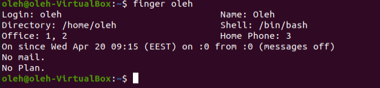

Task 4.1
Part 1
1.	login
2.	passdw - change password	

3.  Determine users in the system

4. 	Change personal information

5.Use "man" adn "info" commands

6. Explore "more" and "less" commands

7. "Finger" command

8. Command "ls"

Part 2
1. "tree" commadn

2. use command "file"

3. "cd"

4. "ls". Using the "-l" and "-a" switcehs

5. All operations

6. Operations with files.

After delete "labwork2", symb_lnk_labwork2" doesn't work
7.locate utility

8.Mounted partitions and types
]
9. "wc"

10. "find" command 

11. "grep"

12. Organize a screen-by-screen print of the contents of the /etc directory
 
13. Type of devices

14. Type of in system

