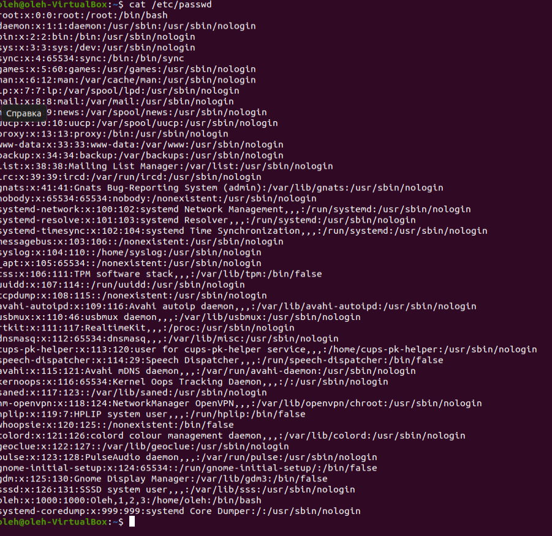
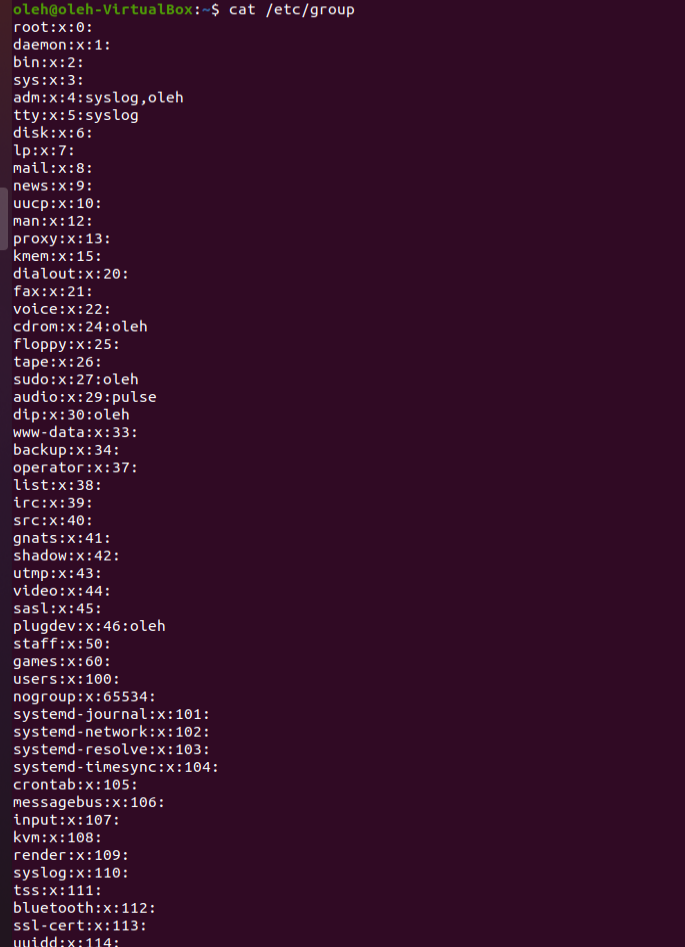
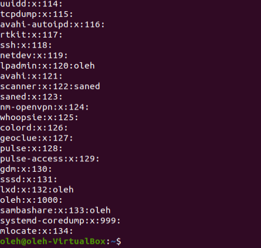
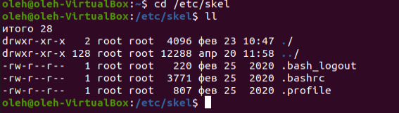
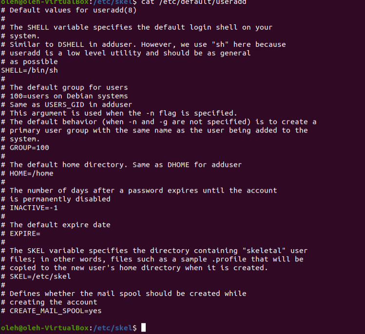
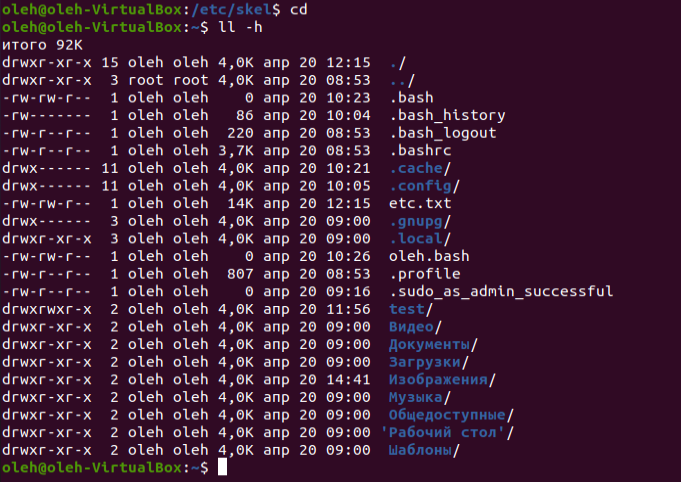

1) There is lines of processes , pseudo-users and regular users in /etc/passwd. Every line have username: pswd: uid: gid: uid comments: directory: shell.

/etc/group containes from "group_name", "password" and "group_id".

2) UID from 1 to 999 its system processes, daemons, pseudo-users etc. And from 1000+ it's regular users in system.
3) This is unique Group ID number in system. You can define both in /etc/passwd and /etc/group.
4) We can define it in /etc/passwd
5) Basic commands to create a user it's 'useradd -m user' after change password 'passwd user' and add to some groups if need 'usermod -aG Group user'
6) Command "usermod -l new_user_name old_user_name"
7) it's "skeleton" or "template" for initiate home directiry for new user. We can change default location from /etc/skel to some other in file /etc/defualt/useradd

8) Command "userdel -r username"
9) We can use the command "passwd -l username" or "usermod -L username" to lock the user. And can unlock him by this commands 'passwd -u username' or 'usermod -U username'
10) If user has sudo privilegies, enable 'NOPASSWD' option in 'sudo visudo'. After use "sudo paswd -d whoami"

11) Use command 'll -h' extend long format with "human" file sizes. In description(inode) of a file we can find - file type, access rigths, owner information, file size, time stamp of creation

12) After first character of file type '-, d, b, c, l, p, s', we can define access rights representation 'rwxrwxrwx'. First triplet its access rights for user(owner, u) next triplet is group owns(g), last is 'others' access rights(o).If we wont change rights for file or directory need use command "chmod g-rw test.txt', 'chmod o=rw test.txt' 
13)
14) Use 'chown' command for changing owner of file or dir.

15)
16) A Sticky bit is a permission bit that is set on a file or a directory that lets only the owner of the file/directory or the root user to delete or rename the file.

17)
