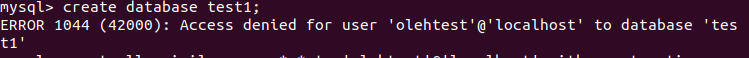

PART 1

1 Download MySQL server for your OS on VM.
2 Install MySQL server on VM.

3 Select a subject area and describe the database schema, (minimum 3 tables)

4 Create a database on the server through the console.
5 Fill in tables.

6 Construct and execute SELECT operator with WHERE, GROUP BY and ORDER BY.
7 Execute other different SQL queries DDL, DML, DCL.

8 Create a database of new users with different privileges. Connect to the databaseas a new user and verify that the privileges allow or deny certain actions.

9 Make a selection from the main table DB MySQL.

PART2

10 Make backup of your database.

11 Delete the table and/or part of the data in the table.

12 Restore your database.

13.Transfer your local database to RDS AWS.

14 Connect to your database.

15 Execute SELECT operator similar step 6.

16 Create the dump of your database.

PART3 _MongoDB
