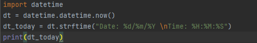
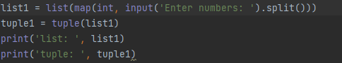

1.Write easy program, which will display current date and time.

2. Write python program, which will accept comma-separated numbers, and then it should write tuple and list of them:Enter numbers: 1, 2, 7, 43, 9Output:List: [‘1’, ‘2’, ‘7’, ‘43’, ‘9’]Tuple: (‘1’, ‘2’, ‘7’, ‘43’, ‘9’)

3.Write python program, which will askfile name. File should be read, and only even lines should be shown.

4.Write python program, which should read htmldocument, parse it, and showit’s title.

5.Write pythonprogram, which will parse user’s text, and replace some emotions with emoji’s (Look: pip install emoji)

6.Write program, that will show basic PC information (OS, RAM amount, HDD’s, andetc.)

